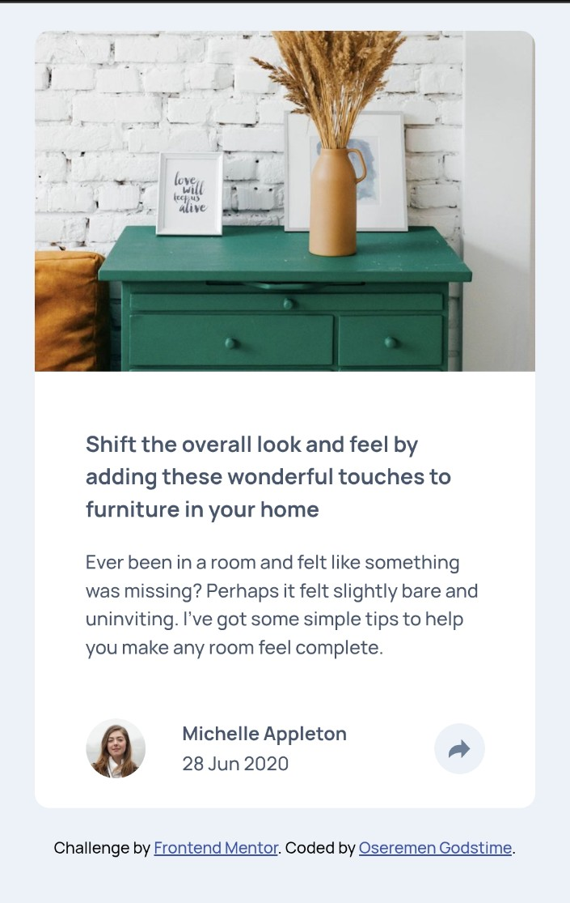

# Frontend Mentor - Article preview component solution

This is a solution to the [Article preview component challenge on Frontend Mentor](https://www.frontendmentor.io/challenges/article-preview-component-dYBN_pYFT). Frontend Mentor challenges help you improve your coding skills by building realistic projects. 

## Table of contents

- [Overview](#overview)
  - [The challenge](#the-challenge)
  - [Screenshot](#screenshot)
  - [Links](#links)
- [My process](#my-process)
  - [Built with](#built-with)
  - [What I learned](#what-i-learned)
  - [Continued development](#continued-development)
  - [Useful resources](#useful-resources)
- [Author](#author)
- [Acknowledgments](#acknowledgments)

**Note: Delete this note and update the table of contents based on what sections you keep.**

## Overview

### The challenge

Users should be able to:

- View the optimal layout for the component depending on their device's screen size
- See the social media share links when they click the share icon

### Screenshot

### Links

- Solution URL: [Solution URL here](https://github.com/devandytech/article-preveiw-component/)
- Live Site URL: [live site URL here](https://devandytech.github.io/article-preveiw-component/)

## My process

Everything(all element) are treated as box containers for easy styling and alignment.

### Built with

- Semantic HTML5 markup
- CSS custom properties
- JavaScript DOM
- Flexbox
- Mobile-first workflow

### What I learned

I was going to use the JavaScript toggle to manipulate elements on when the share is been clicked initially, but encounter some errors and i decided to use and adapte another approach by using the javascript classlist(add and remove) and conditional statement(if...else) for manipulation.

### Continued development

I thought at the beginning that this project was going to be a walk through for me tho, i really would love to see if there was other techniques or processes used in this project by other participants.

## Author

- Frontend Mentor - [@devandytech](https://www.frontendmentor.io/profile/devandytech)
- Twitter - [@devandytech](https://www.twitter.com/devandytech)

## Acknowledgments

I did figure everything out myself eventually though, but i have decided to experiment with some library and resources used. For example, for DOM media query which was almost making havoc and confusion for me i found a useful JavaScript library.

- Link - [enquire.js](https://wicky.nillia.ms/enquire.js/)

